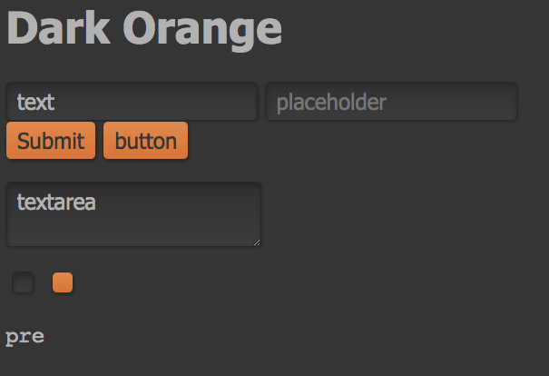

# Dark Orange UI
Retro-themed pure CSS style with tint of autumn colors.

Just drop css file to get some styling to unstyled UIs, for example like so

    <head><link rel="stylesheet" type="text/css" href="style.css"></head>

# Author
Samuel Carlsson <samuel.carlsson@gmail.com>
